# 🥋 DojoSearch

> Web platform for managing and discovering martial arts events.


---

## 📋 Table of Contents

1. [Description](#description)
2. [Features](#features)
3. [Project Structure](#project-structure)
4. [Requirements](#requirements)
5. [Installation](#installation)
6. [Database](#database)
7. [User Roles](#user-roles)
8. [Class Diagram](#class-diagram)
9. [Sequence Diagrams](#sequence-diagrams)
10. [Tech Stack](#tech-stack)

---

## Description

**DojoSearch** is a web application built with native PHP following an **MVC** architecture. It allows users to browse, register for and manage martial arts events. Administrators can create, edit and delete events from a dedicated control panel.

---

## Features

- 🔐 **Authentication** — Registration and login with passwords hashed via `password_hash` (bcrypt).
- 👤 **User Profiles** — Edit personal data, profile photo (BLOB), social networks, bio, phone and notification preferences.
- 🗓️ **Event Management** — Full CRUD for events (create, read, edit, delete).
- 🔍 **Event Detail** — Individual view with all event information.
- 🛡️ **Access Control** — Session-protected routes; admin panel exclusive to administrators.
- 📱 **Responsive Design** — Interface adapted for mobile, tablet and desktop.

---

## Project Structure

```
MP0487_RA5RA6_DojoSearch/
├── controllers/
│   ├── db_connection.php      # PDO connection to MySQL
│   ├── EventController.php    # Event CRUD
│   └── UserController.php     # Auth, registration and profile management
├── models/
│   └── database/
│       ├── seed.sql           # Database creation script and seed data
│       └── xml/
│           └── users.xml
├── views/
│   ├── assets/
│   │   ├── css/               # Stylesheets (style.css, events.css, profile.css…)
│   │   ├── images/            # Images, icons, logos
│   │   └── videos/            # Hero background video
│   └── php/
│       ├── index.php          # Landing page
│       ├── login.php          # Login page
│       ├── register.php       # New user registration
│       ├── events.php         # Event listing
│       ├── detail.php         # Single event detail
│       ├── manageEvents.php   # Create / edit events (admin)
│       ├── userAdmin.php      # Administrator profile
│       └── userUser.php       # Standard user profile
└── README.md
```

---

## Requirements

| Tool | Minimum version |
|------|----------------|
| PHP | 8.0 |
| MySQL | 8.0 |
| XAMPP / Apache | Any |
| Modern browser | Chrome, Firefox, Edge |

---

## Installation

1. **Clone or copy** the project into `C:\xampp\htdocs\`:
   ```
   C:\xampp\htdocs\MP0487\MP0487_RA5RA6_DojoSearch\
   ```

2. **Start** Apache and MySQL from the XAMPP control panel.

3. **Create the database** by running the SQL script in phpMyAdmin or from the terminal:
   ```bash
   mysql -u root -p < models/database/seed.sql
   ```

4. **Configure the connection** in `controllers/db_connection.php` if your settings differ:
   ```php
   $server   = "127.0.0.1";
   $user     = "root";
   $password = "";
   $database = "mp0487_dojosearch";
   $port     = 3306;
   ```

5. Open the application in your browser:
   ```
   http://localhost/MP0487/MP0487_RA5RA6_DojoSearch/views/php/index.php
   ```

---

## Database

**Name:** `mp0487_dojosearch`

### Table `users`

| Column | Type | Description |
|--------|------|-------------|
| `id` | INT UNSIGNED PK | Unique identifier |
| `name` | VARCHAR(100) | Full name |
| `username` | VARCHAR(50) UNIQUE | Username |
| `email` | VARCHAR(150) UNIQUE | Email address |
| `fecha_born` | DATE | Date of birth |
| `password` | VARCHAR(255) | bcrypt hash |
| `is_admin` | TINYINT(1) | 1 = administrator |
| `photo` | LONGBLOB | Profile photo |
| `bio` | TEXT | Biography |
| `phone` | VARCHAR(20) | Phone number |
| `twitter` | VARCHAR(100) | Twitter profile |
| `instagram` | VARCHAR(100) | Instagram profile |
| `facebook` | VARCHAR(100) | Facebook profile |
| `youtube` | VARCHAR(100) | YouTube channel |
| `email_messages` | TINYINT(1) | Message notifications |
| `email_reminders` | TINYINT(1) | Reminder notifications |
| `email_promotions` | TINYINT(1) | Promotional notifications |
| `created_at` | DATETIME | Registration date |

### Table `events`

| Column | Type | Description |
|--------|------|-------------|
| `id` | INT UNSIGNED PK | Unique identifier |
| `name` | VARCHAR(150) | Event name |
| `description` | TEXT | Description |
| `date` | DATETIME | Date and time |
| `location` | VARCHAR(200) | Event venue |

---

## User Roles

| Role | Access |
|------|--------|
| **Visitor** | `index.php`, `login.php`, `register.php` |
| **User** | All of the above + `events.php`, `detail.php`, `userUser.php` |
| **Administrator** | All of the above + `userAdmin.php`, `manageEvents.php` (create/edit/delete events) |

---

## Class Diagram

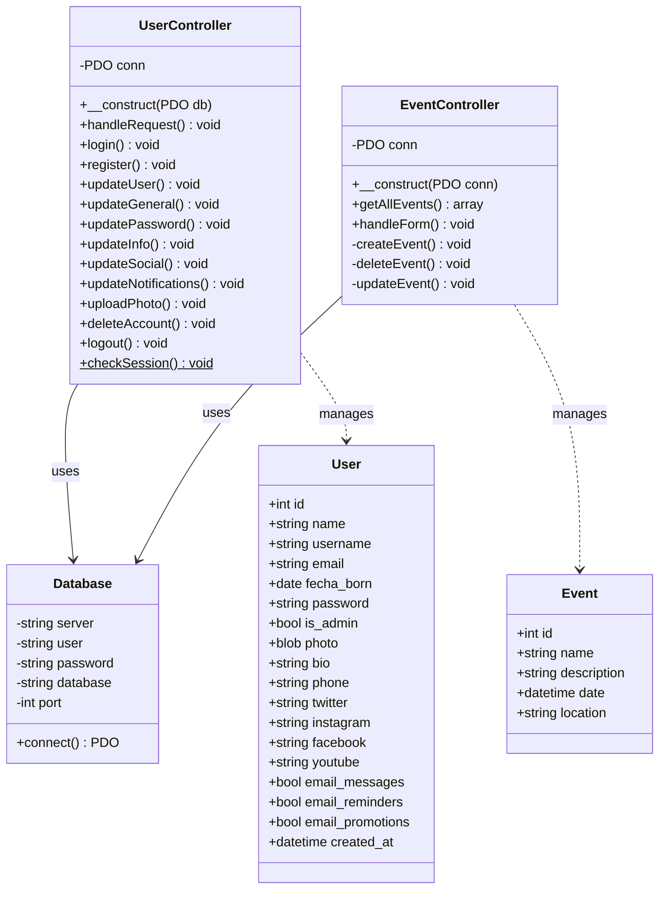

---

## Sequence Diagrams

### 1. Login

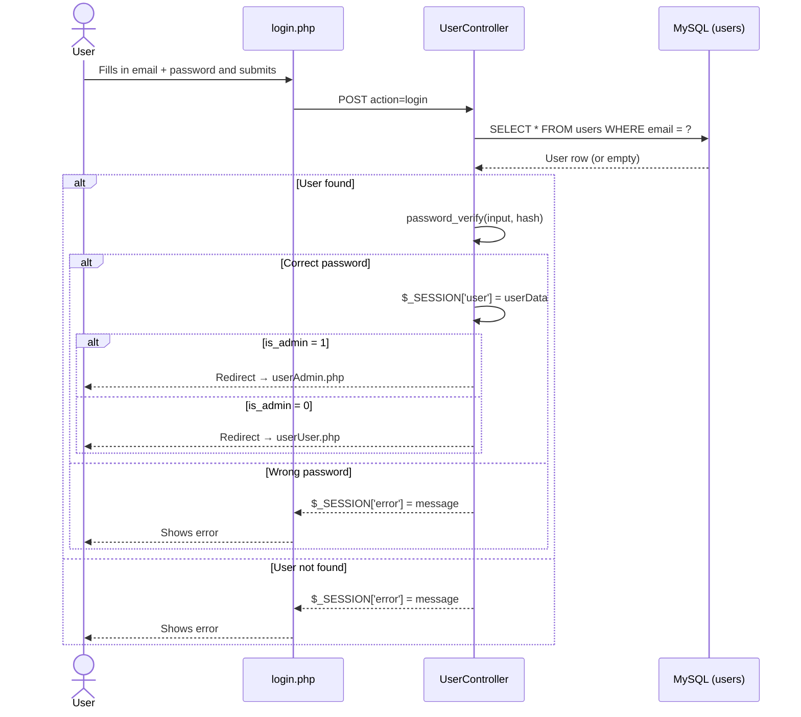

### 2. User Registration

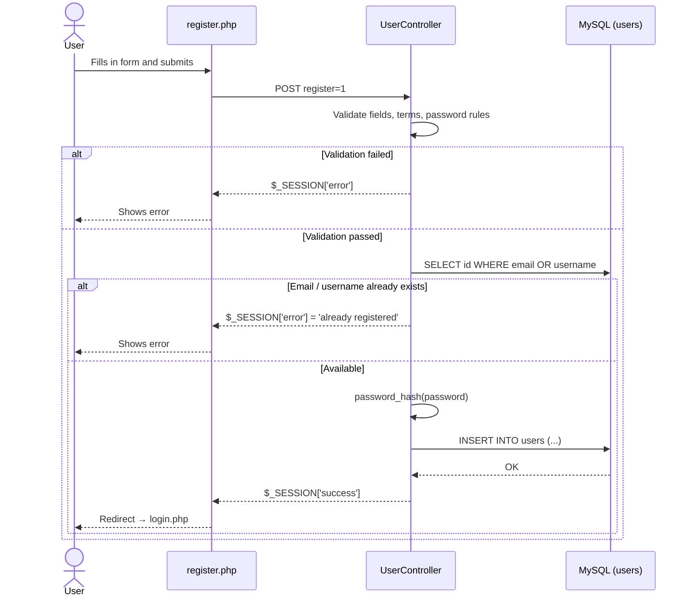

### 3. Create an Event (Admin)

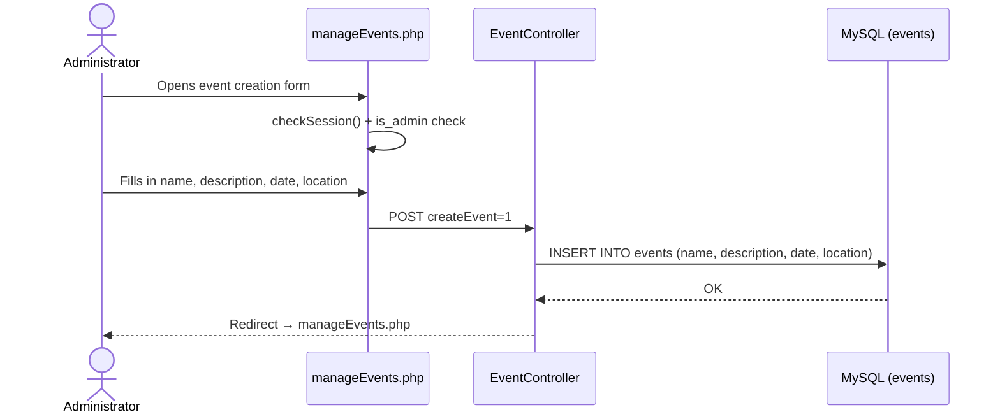

### 4. View Event Detail

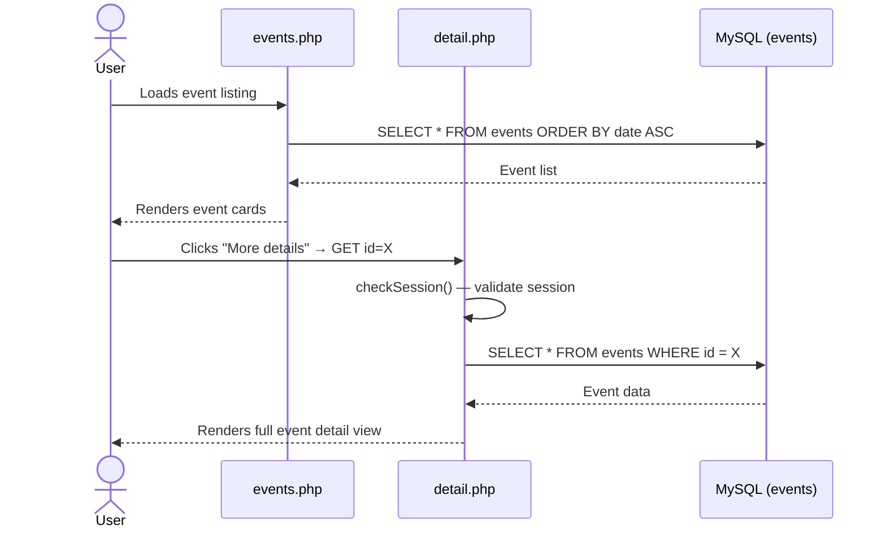

### 5. Update User Profile

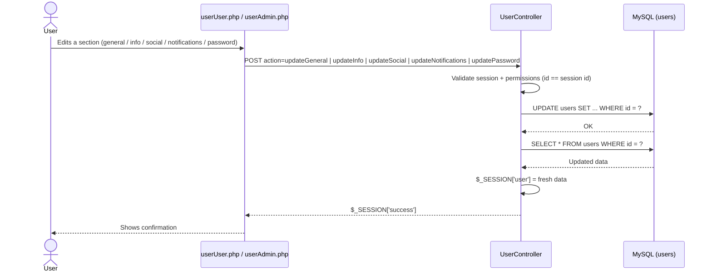

---

## Tech Stack

| Layer | Technology |
|-------|-----------|
| Backend | PHP 8 (native, MVC pattern) |
| Database | MySQL 8 + PDO |
| Frontend | HTML5, CSS3, Bootstrap 4.5 |
| Icons | Font Awesome 6 |
| Typography | Google Fonts (Bebas Neue, Montserrat) |
| Maps | Leaflet.js |
| Local server | XAMPP (Apache + MySQL) |

---

> Academic project — Module MP0487 · RA5/RA6 · DojoSearch


---

## 📋 Tabla de contenidos

1. [Descripción](#descripción)
2. [Características](#características)
3. [Estructura del proyecto](#estructura-del-proyecto)
4. [Requisitos](#requisitos)
5. [Instalación](#instalación)
6. [Base de datos](#base-de-datos)
7. [Roles de usuario](#roles-de-usuario)
8. [Diagrama de clases](#diagrama-de-clases)
9. [Diagrama de secuencia](#diagrama-de-secuencia)
10. [Tecnologías utilizadas](#tecnologías-utilizadas)

---

## Descripción

**DojoSearch** es una aplicación web desarrollada en PHP nativo con arquitectura **MVC** que permite a los usuarios explorar, registrarse y gestionar eventos de artes marciales. Los administradores pueden crear, editar y eliminar eventos desde un panel de control dedicado.

---

## Características

- 🔐 **Autenticación** — Registro e inicio de sesión con contraseñas cifradas con `password_hash` (bcrypt).
- 👤 **Perfiles de usuario** — Edición de datos personales, foto de perfil (BLOB), redes sociales, bio, teléfono y preferencias de notificaciones.
- 🗓️ **Gestión de eventos** — CRUD completo de eventos (crear, leer, editar, eliminar).
- 🔍 **Detalle de evento** — Vista individual con toda la información del evento.
- 🛡️ **Control de acceso** — Rutas protegidas por sesión; panel de administración exclusivo para admins.
- 📱 **Diseño responsive** — Interfaz adaptada a móvil, tablet y escritorio.

---

## Estructura del proyecto

```
MP0487_RA5RA6_DojoSearch/
├── controllers/
│   ├── db_connection.php      # Conexión PDO a MySQL
│   ├── EventController.php    # CRUD de eventos
│   └── UserController.php     # Auth, registro y gestión de perfil
├── models/
│   └── database/
│       ├── seed.sql           # Script de creación de BD y datos iniciales
│       └── xml/
│           └── users.xml
├── views/
│   ├── assets/
│   │   ├── css/               # Hojas de estilo (style.css, events.css, profile.css…)
│   │   ├── images/            # Imágenes, iconos, logos
│   │   └── videos/            # Video de fondo del hero
│   └── php/
│       ├── index.php          # Página principal / landing
│       ├── login.php          # Inicio de sesión
│       ├── register.php       # Registro de nuevo usuario
│       ├── events.php         # Listado de eventos
│       ├── detail.php         # Detalle de un evento
│       ├── manageEvents.php   # Crear / editar eventos (admin)
│       ├── userAdmin.php      # Perfil del administrador
│       └── userUser.php       # Perfil del usuario estándar
└── README.md
```

---

## Requisitos

| Herramienta | Versión mínima |
|-------------|---------------|
| PHP         | 8.0           |
| MySQL       | 8.0           |
| XAMPP / Apache | Cualquiera |
| Navegador moderno | Chrome, Firefox, Edge |

---

## Instalación

1. **Clonar o copiar** el proyecto en `C:\xampp\htdocs\`:
   ```
   C:\xampp\htdocs\MP0487\MP0487_RA5RA6_DojoSearch\
   ```

2. **Iniciar** Apache y MySQL desde el panel de XAMPP.

3. **Crear la base de datos** ejecutando el script SQL en phpMyAdmin o desde la terminal:
   ```bash
   mysql -u root -p < models/database/seed.sql
   ```

4. **Configurar la conexión** en `controllers/db_connection.php` si los datos difieren:
   ```php
   $server   = "127.0.0.1";
   $user     = "root";
   $password = "";
   $database = "mp0487_dojosearch";
   $port     = 3306;
   ```

5. Acceder a la aplicación en el navegador:
   ```
   http://localhost/MP0487/MP0487_RA5RA6_DojoSearch/views/php/index.php
   ```

---

## Base de datos

**Nombre:** `mp0487_dojosearch`

### Tabla `users`

| Columna | Tipo | Descripción |
|---------|------|-------------|
| `id` | INT UNSIGNED PK | Identificador único |
| `name` | VARCHAR(100) | Nombre completo |
| `username` | VARCHAR(50) UNIQUE | Nombre de usuario |
| `email` | VARCHAR(150) UNIQUE | Correo electrónico |
| `fecha_born` | DATE | Fecha de nacimiento |
| `password` | VARCHAR(255) | Hash bcrypt |
| `is_admin` | TINYINT(1) | 1 = administrador |
| `photo` | LONGBLOB | Foto de perfil |
| `bio` | TEXT | Biografía |
| `phone` | VARCHAR(20) | Teléfono |
| `twitter` | VARCHAR(100) | Perfil Twitter |
| `instagram` | VARCHAR(100) | Perfil Instagram |
| `facebook` | VARCHAR(100) | Perfil Facebook |
| `youtube` | VARCHAR(100) | Canal YouTube |
| `email_messages` | TINYINT(1) | Notif. mensajes |
| `email_reminders` | TINYINT(1) | Notif. recordatorios |
| `email_promotions` | TINYINT(1) | Notif. promociones |
| `created_at` | DATETIME | Fecha de registro |

### Tabla `events`

| Columna | Tipo | Descripción |
|---------|------|-------------|
| `id` | INT UNSIGNED PK | Identificador único |
| `name` | VARCHAR(150) | Nombre del evento |
| `description` | TEXT | Descripción |
| `date` | DATETIME | Fecha y hora |
| `location` | VARCHAR(200) | Lugar del evento |

---

## Roles de usuario

| Rol | Acceso |
|-----|--------|
| **Visitante** | `index.php`, `login.php`, `register.php` |
| **Usuario** | Todo lo anterior + `events.php`, `detail.php`, `userUser.php` |
| **Administrador** | Todo lo anterior + `userAdmin.php`, `manageEvents.php` (crear/editar/eliminar eventos) |

---

## Diagrama de clases


---

## Diagrama de secuencia

### 1. Inicio de sesión (Login)

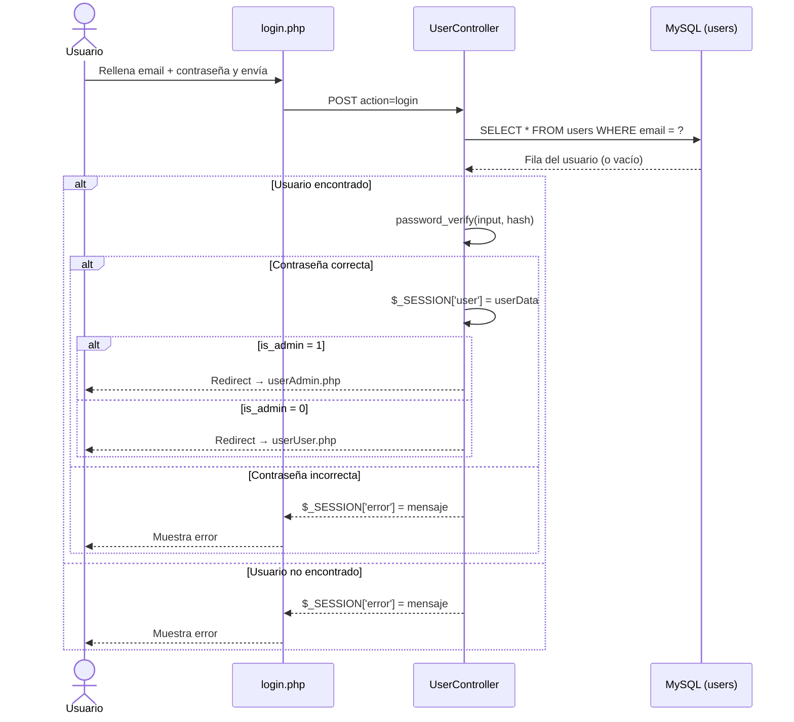

### 2. Registro de nuevo usuario

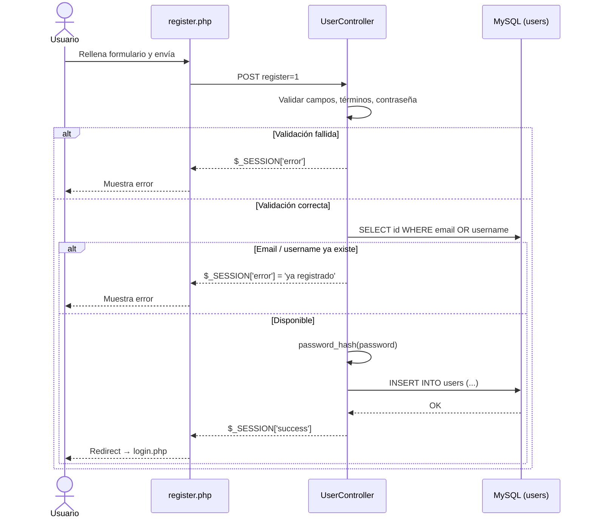

### 3. Crear un evento (Admin)

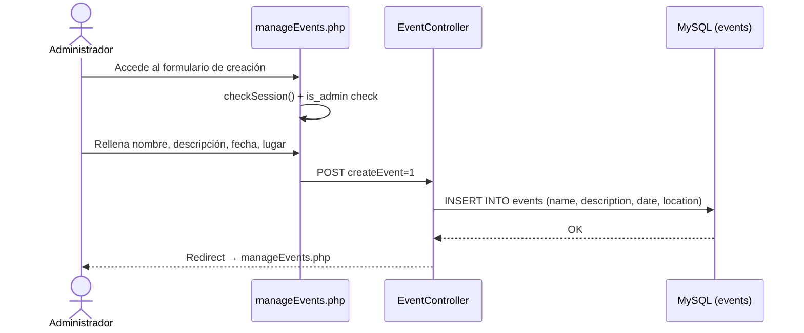

### 4. Ver detalle de un evento

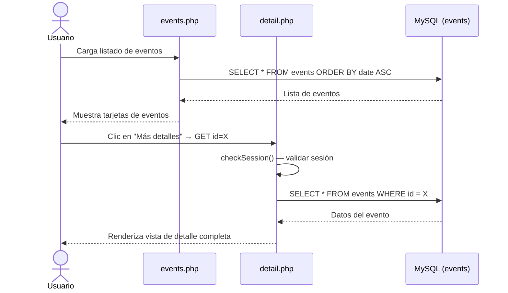

### 5. Actualizar perfil de usuario

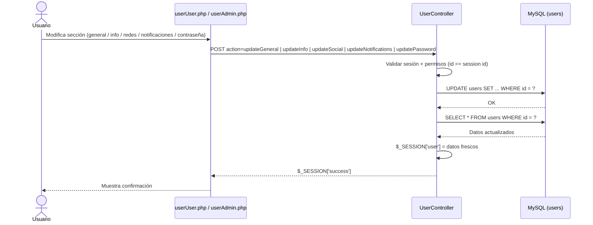

---

## Tecnologías utilizadas

| Capa | Tecnología |
|------|-----------|
| Backend | PHP 8 (nativo, patrón MVC) |
| Base de datos | MySQL 8 + PDO |
| Frontend | HTML5, CSS3, Bootstrap 4.5 |
| Iconos | Font Awesome 6 |
| Tipografía | Google Fonts (Bebas Neue, Montserrat) |
| Mapas | Leaflet.js |
| Servidor local | XAMPP (Apache + MySQL) |

---

> Proyecto académico — Módulo MP0487 · RA5/RA6 · DojoSearch
